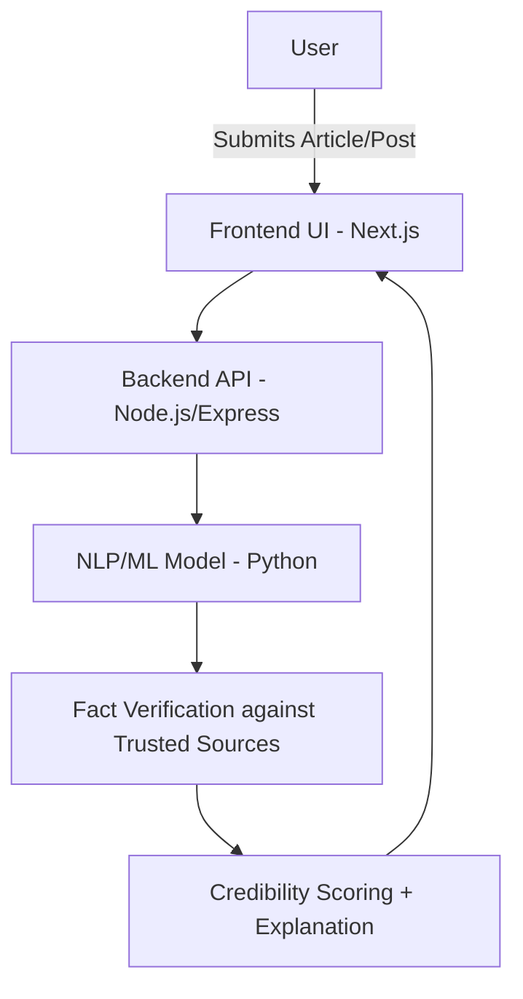

# 📰 NewsNudge – AI-Powered Tool for Combating Misinformation  

## 📌 Overview  
**NewsNudge** is an AI-driven platform designed to tackle the growing issue of **fake news and misinformation**.  
It leverages **Natural Language Processing (NLP)** and **Machine Learning (ML)** to analyze news articles, social media posts, and shared content **in real time**.  

The system detects misleading claims, verifies facts against trusted sources, and provides users with **credibility scores** and **contextual explanations**.  
By combining automation with transparency, NewsNudge empowers individuals to make informed decisions, promotes digital literacy, and contributes to building a healthier information ecosystem.  

---

## 🚀 Key Features  
- **Real-Time Misinformation Detection** – Instantly scans articles/posts.  
- **Credibility Scoring** – Rates content on a scale (e.g., Reliable → Suspicious).  
- **Fact Verification** – Cross-checks against trusted datasets & news sources.  
- **Contextual Explanations** – Explains why content may be misleading.  
- **User-Friendly Dashboard** – Simple interface with alerts, highlights & insights.  
- **Browser & Social Media Integration** – Works where misinformation spreads most.  
- **Educational Nudges** – Builds user awareness & media literacy.  

---

## 🔑 Why NewsNudge?  
- Most fact-checking sites are **manual and slow** → NewsNudge provides **real-time analysis**.  
- Existing tools often just **flag content** → NewsNudge explains *why* it’s unreliable with **context + sources**.  
- Instead of being a **static website**, it integrates into **social media feeds, news apps, and browsers** for instant nudges.  

---

## 🛠️ Tech Stack  

### Frontend  
- **Next.js (React)**  
- **TypeScript**  
- **Tailwind CSS**  
- **Vercel** (deployment)  

### Backend  
- **Node.js**  
- **Express.js**  
- **Python** (ML integration)  

### Machine Learning  
- **Python scripts (predict.py)**  
- **Trained Models (.pkl)**  
- **Vectorizer**  

---

## 📊 System Architecture  

## 👥 Team ByteBandits

* Aayush Mali – Backend Developer (Core system & integration) @AayushMali

* Rohit Mahajan – Frontend Developer (UI/UX design & dashboard) @Rohitisavailable

* Riddhi Katkar – ML Engineer (Model training for misinformation detection) @RiddhiKatkar

* Sarthak Padale – Data Specialist (Dataset collection & preprocessing) @Sarthakpadale641

* Shreya Mhasurle – Research & API Support (Resources & API integration)

## ⚡ Getting Started

### Prerequisites

* Python 3.9+

* Node.js & npm

* MongoDB/PostgreSQL (optional for datasets)

* API keys for news/fact-checking sources

## ⬇️Installation
### 1. Clone the repository  
```bash
git clone https://github.com/AayushMali/NewsNudge.git
cd NewsNudge
```
### 2. Backend Setup
```bash
cd backend
npm install
node server.js
```
### 3. ML Service
```bash
cd ml-service
pip install -r requirements.txt
python predict.py
```
### 4. Frontend Setup
```bash
cd frontend
npm install
npm run dev
```
## ▶️ Usage

1. Open the dashboard in your browser.

2. Paste or input any article/post link.

3. Get real-time credibility scores, fact-checks, and context.

## 🌍 Future Scope

* Multilingual Support – Extend to multiple regional & global languages.

* Mobile App – Native apps for Android/iOS.

* Deeper Integrations – Social media platforms, messaging apps, browsers.

* Community Feedback – Allow users to report or validate claims.

* Explainable AI – More transparent ML decision-making for user trust.

## 📜 License

This project is licensed under the MIT License – free to use and modify with attribution.


